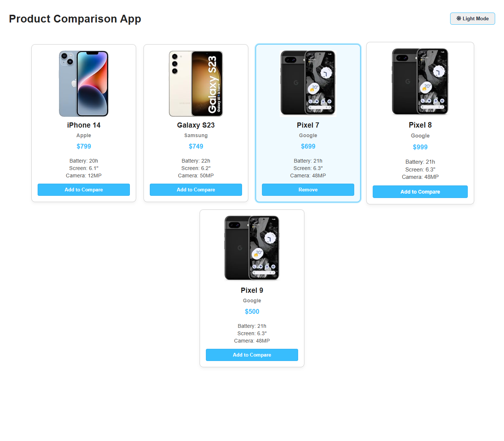
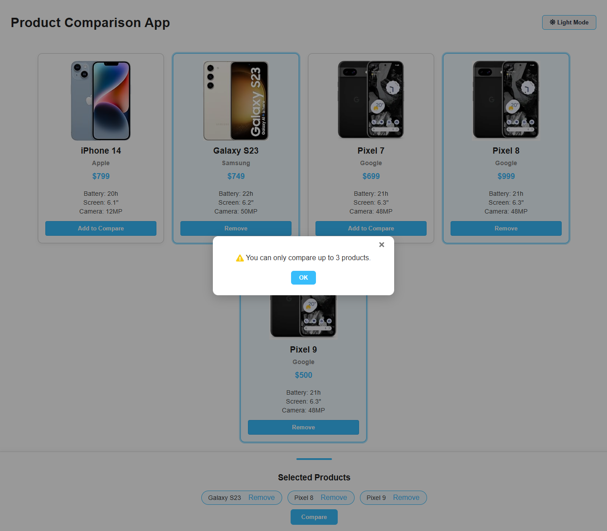
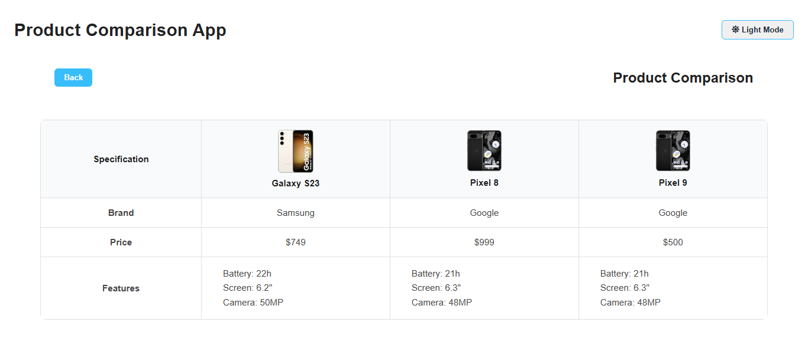
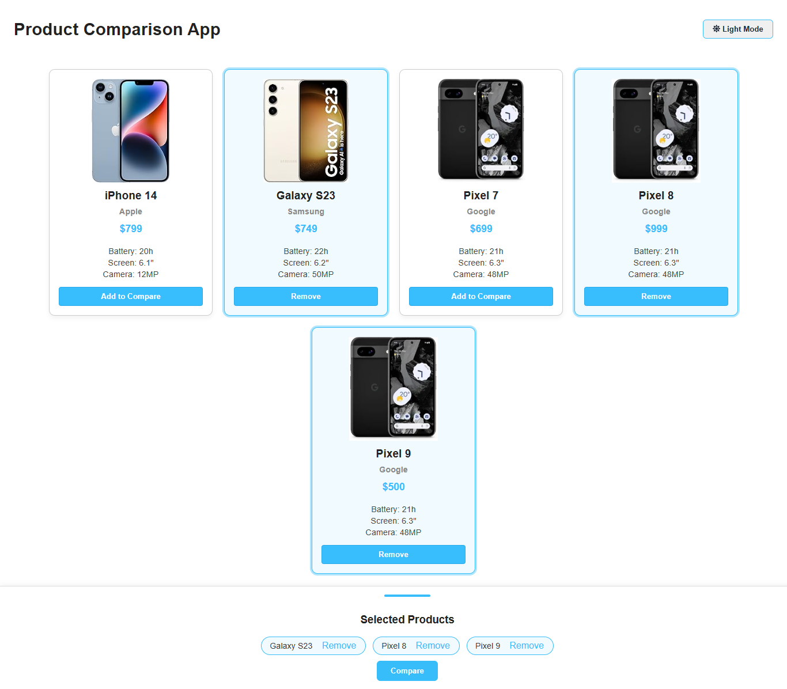

# Product Comparison App

A responsive, theme-switchable web app built in React for comparing up to 3 products. Users can add items to compare, toggle between light/dark mode, and view key specs in a clean table layout.

## 🛠️ Built With

- JavaScript (ES6+)
- React (v19.1.0)
- CSS (custom styling + responsive layout)
- React Icons
- Local Storage for state persistence

## ✨ Features

- Add/remove products from comparison
- Limit up to 3 products (with modal warning)
- Comparison view with responsive table
- Light/Dark mode toggle
- Data persistence via `localStorage`

## 🚀 Getting Started

To run this project locally:

1. **Clone the repository:**

   ```bash
   git clone https://github.com/bhatiminu/product-comparison-app.git
   cd product-comparison-app

    Install dependencies:
    npm install

    Start the development server:
    npm start

    
    
    
    
